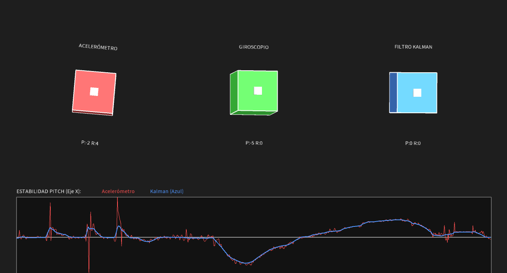
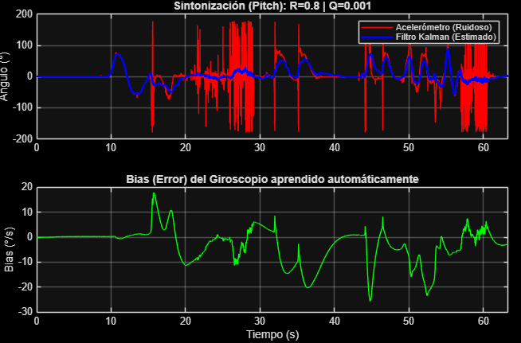

# 🧠 K-Sense: Kit Educativo de Fusión Sensorial

**Autores:** Juan David Meza Criollo   
Universidad Nacional de Colombia

  

## 📖 Descripción
K-Sense es una plataforma didáctica diseñada para visualizar en tiempo real la importancia de los algoritmos de fusión sensorial. Utilizando un **ESP32** y una IMU **BMI160**, el sistema permite comparar el comportamiento de sensores inerciales independientes frente a una solución fusionada con **Filtro de Kalman**.

El objetivo es demostrar visualmente que **ningún sensor es perfecto por sí solo**, pero su combinación matemática puede ofrecer resultados robustos.

---

## 🎓 Explicación Conceptual

### ¿Por qué los sensores independientes no son suficientes?

Para la estimación de orientación en robótica, dependemos de dos fuentes físicas, cada una con algún defecto:

1.  🔴 **Acelerómetro (El problema del Ruido):** Usa la gravedad como referencia.
    * *Falla:* Es extremadamente sensible a vibraciones mecánicas. Cualquier golpe en la mesa o movimiento brusco "ensucia" la señal, volviéndola inutilizable para control preciso.
2.  🔵 **Giroscopio (El problema del Drift):** Mide velocidad de rotación e integra en el tiempo.
    * *Falla:* Sufre de deriva. Pequeños errores de medición se suman en cada ciclo. Al cabo de un minuto, el sensor puede indicar que está inclinado 20° aunque esté plano.

### 🟢 La Solución: Fusión Sensorial (Kalman)
El Filtro de Kalman lineal implementado actúa como un "árbitro" inteligente:
* Usa el giroscopio para **predecir** el movimiento rápido (alta respuesta).
* Usa el acelerómetro para **corregir** la deriva a largo plazo (referencia absoluta).
* El resultado es una señal limpia, rápida y sin deriva. Aunque se acumularia con el tiempo de todas maneras. 

---

## 🎛️ Efectos de las Matrices Q y R

En la teoría de control óptimo, el comportamiento del filtro se define ajustando sus matrices de covarianza. Puedes modificar estos valores para ver sus efectos físicos:

### Matriz Q (Process Noise)
Representa la incertidumbre de nuestro modelo matemático (Giroscopio).
* **Q Alta:** El filtro "desconfía" del giroscopio y sigue más al acelerómetro.
    * *Efecto:* Respuesta muy rápida, pero la señal se vuelve **ruidosa**.
* **Q Baja:** El filtro confía ciegamente en la predicción del giroscopio.
    * *Efecto:* Señal muy suave, pero puede tener **retraso (lag)** al corregir errores.

### Matriz R (Measurement Noise)
Representa la incertidumbre de la medición física (Acelerómetro).
* **R Alta:** Le decimos al filtro que el sensor tiene mucho ruido.
    * *Efecto:* El filtro ignora las vibraciones (línea muy suave), pero tarda en reaccionar a cambios reales.
* **R Baja:** Le decimos que el sensor es perfecto.
    * *Efecto:* El filtro deja pasar todas las vibraciones mecánicas.

> **Valores por defecto en K-Sense:** `Q=0.08` y `R=0.55`. Estos han sido sintonizados experimentalmente para filtrar golpes en la mesa sin perder agilidad en la rotación manual. Se hizo tomas y luego se procesaron en matlab para ver la mejor pareja de parametros experimentales.

  

---

## 🚀 Instalación

1.  **Firmware:** Abrir la carpeta `K_sense_v2` con **VS Code + PlatformIO**. Conectar el ESP32 y subir.
2.  **Visualizador:** Abrir `k_sense_v2/Visualizador_K_Sense.pde` con **Processing**.
3.  **Uso:** Mantener el sensor quieto 3 segundos al iniciar para la auto-calibración.
